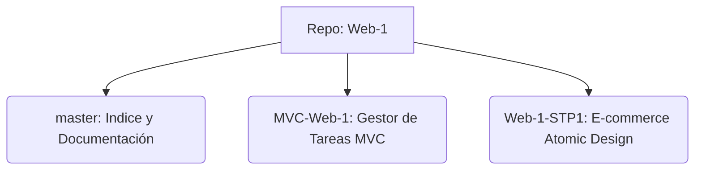

# Trabajos Prácticos - Web 1 (2026)

Este repositorio centraliza todos los proyectos y trabajos prácticos realizados durante la cursada de **Web 1 - 2026**. Para mantener la organización, cada proyecto principal se encuentra en su propia **rama**.

## 🌲 Estructura de Ramas



| Rama | Proyecto | Descripción | Tecnologías |
| :--- | :--- | :--- | :--- |
| [`master`](https://github.com/Niquinhoo/Web-1/tree/master) | Índice | Documentación general del repositorio. | Markdown |
| [`MVC-Web-1`](https://github.com/Niquinhoo/Web-1/tree/MVC-Web-1) | Task Manager | Aplicación de gestión de tareas aplicando el patrón MVC. | Express, EJS, Node.js |
| [`Web-1-STP1`](https://github.com/Niquinhoo/Web-1/tree/Web-1-STP1) | E-commerce | Plataforma de comercio electrónico con arquitectura Atomic Design. | Express, EJS, CSS (Modular), Atomic Design |

---

## 🚀 Proyectos Distribuidos

### 1. [Gestor de Tareas](https://github.com/Niquinhoo/Web-1/tree/MVC-Web-1) (Rama: `MVC-Web-1`)
Una implementación limpia del patrón **Modelo-Vista-Controlador**. 
- **Estructura:** Separación clara entre lógica de datos (`models`), lógica de negocio (`controllers`) y presentación (`views`).
- **Funcionalidad:** Listado y detalle de tareas pendientes.

### 2. [E-commerce Premium](https://github.com/Niquinhoo/Web-1/tree/Web-1-STP1) (Rama: `Web-1-STP1`)
Un proyecto avanzado que utiliza **Atomic Design** para una interfaz altamente modular y escalable.
- **Arquitectura:** Componentes divididos en Átomos, Moléculas, Organismos y Plantillas.
- **Características:** 
    - Flujo de compra completo (Carrito, Checkout).
    - Sistema de autenticación (Login/Register).
    - Catálogo dinámico de productos y categorías.
    - Documentación basada en User Stories.

---

## 🛠️ Cómo navegar por los proyectos

Para ver el código de un proyecto específico, cambia de rama en tu terminal o en la interfaz de GitHub:

```bash
# Para ver el E-commerce
git checkout Web-1-STP1

# Para ver el Gestor de Tareas
git checkout MVC-Web-1
```
