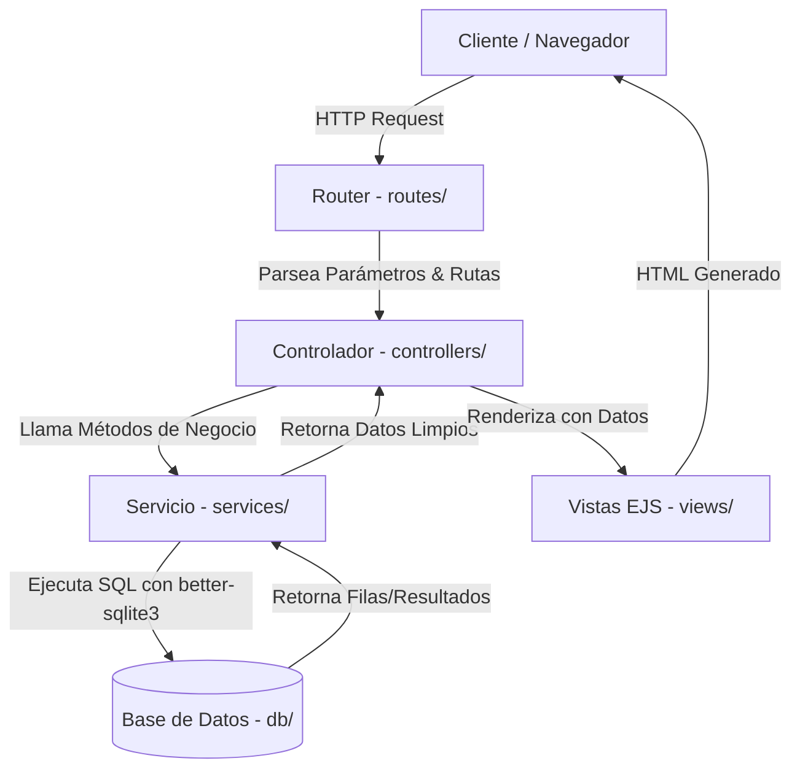

# Web-1 (STP4) — E-Commerce SSR + API REST con Express y SQLite

## Contexto de la rama

`Web-1-STP4` es la etapa actual del e-commerce y se construye sobre la persistencia de `Web-1-STP3`. El backend mantiene el frontend SSR con EJS y agrega una segunda salida para clientes externos: una API REST JSON bajo `/api`.

Incluye `express.json()`, CORS, CRUD de productos y categorías, `/api/stats`, validación de cuerpos e IDs, respuestas HTTP consistentes, control de errores JSON y pruebas integradas. Los controladores API reutilizan los servicios existentes y no duplican SQL.

Aplicación web server-side rendering (SSR) construida con **Node.js**, **Express**, **EJS** y **SQLite** (`better-sqlite3`). El proyecto implementa un flujo completo de e-commerce con persistencia de datos real, validaciones backend, control de sesiones, y una interfaz de usuario modular diseñada bajo principios de **Atomic Design** tanto para vistas como para estilos.

---

## 🛠️ Stack Tecnológico

- **Runtime:** Node.js
- **Framework Web:** Express `5.2.1`
- **Motor de Plantillas:** EJS `5.0.1`
- **Persistencia:** SQLite a través de `better-sqlite3` `^12.9.0`
- **Manejo de Sesiones:** `express-session` `1.19.0` (empleado para persistir temporalmente el estado del carrito y sesiones)
- **Desarrollo Local:** `nodemon` `3.1.14`
- **Diseño de Interfaz:** CSS modular bajo arquitectura **Atomic Design**

---

## 🚀 Cómo Ejecutar el Proyecto

1. **Instalar dependencias:**
   ```bash
   npm install
   ```

2. **Ejecutar migraciones y semilla (opcional, se hace automáticamente al iniciar la app):**
   ```bash
   node migrate.js
   ```

3. **Iniciar el servidor:**
   - Modo normal:
     ```bash
     node app.js
     ```
   - Modo desarrollo (con recarga automática):
     ```bash
     npx nodemon app.js
     ```

4. **Acceder a la aplicación:**
   Abrir en el navegador [http://localhost:3000](http://localhost:3000)

---

## 📂 Estructura General del Proyecto

La estructura del repositorio refleja una clara separación de responsabilidades y sigue una arquitectura en capas:

```text
.
├── app.js                 # Punto de entrada principal y configuración de Express
├── migrate.js             # Script auxiliar para ejecutar y diagnosticar migraciones de la DB
├── package.json           # Definición de dependencias y metadata del proyecto
├── controllers/           # Controladores: Capa delgada que maneja la lógica HTTP (req, res, render)
│   ├── cartController.js
│   └── productController.js
├── data/                  # Datos semilla estáticos y configuraciones iniciales
│   ├── homeContent.js
│   └── seedData.js
├── db/                    # Persistencia y base de datos
│   ├── bootstrap.js       # Migraciones incrementales y carga idempotente de datos semilla
│   ├── database.db        # Archivo de base de datos SQLite (generado automáticamente)
│   ├── database.js        # Configuración de la conexión e inicialización (Punto Único de Entrada)
│   └── schema.sql         # Esquema de tablas relacionales de la base de datos
├── documentacion/         # Historias de usuario, especificaciones y guías de desarrollo
├── public/                # Archivos estáticos servidos públicamente
│   ├── scripts/           # Scripts JS del lado del cliente
│   └── styles/            # Hojas de estilo estructuradas con Atomic Design (base, atoms, molecules, etc.)
├── routes/                # Enrutadores que mapean URLs a los controladores correspondientes
│   ├── account.router.js
│   ├── cart.router.js
│   ├── categories.router.js
│   ├── checkout.router.js
│   ├── index.router.js
│   ├── login.router.js
│   ├── productos.router.js
│   ├── register.router.js
│   └── search.router.js
├── services/              # Capa de Negocio: Lógica pura y acceso a datos SQLite (libre de req/res)
│   ├── cartService.js
│   ├── catalogService.js
│   └── productsService.js
└── views/                 # Vistas dinámicas EJS modularizadas en componentes
    ├── index.ejs          # Punto de entrada global de vistas
    └── partials/          # Componentes de presentación organizados por Atomic Design
        ├── head-favicons.ejs
        ├── templates/     # Layouts estructurales (home-layout, cart-layout, etc.)
        ├── organisms/     # Componentes complejos autónomos (navbar, grid de productos)
        ├── molecules/     # Bloques de UI reutilizables medianos (tarjetas, banners, inputs)
        └── atoms/         # Unidades mínimas de UI (botones, textos, badges de precio)
```

---

## 💾 Persistencia y Base de Datos (SQLite)

La transición desde objetos mock en memoria (STP1) a persistencia SQL (STP3) se estructuró para garantizar robustez y consistencia:

- **Single Point of Entry (`db/database.js`):** Encapsula la conexión física a `database.db`. Garantiza la ejecución inicial del script de definición de esquemas (`schema.sql`).
- **Esquema Relacional (`db/schema.sql`):** Define cinco tablas clave:
  - `categories`: Clasificación de productos (tecnología, comida, etc.).
  - `products`: Detalles del catálogo de productos con relaciones a categorías.
  - `users`: Cuentas con campos para contraseñas de forma segura (`password_hash`).
  - `orders` y `order_items`: Gestión relacional de compras completadas vinculando usuarios y productos con integridad referencial (claves foráneas).
- **Proceso de Bootstrap (`db/bootstrap.js`):**
  - **Migración de Esquema:** Detecta dinámicamente si la tabla `users` requiere modificaciones estructurales. Si se detecta una estructura legacy (como contraseñas en texto plano `password`), renombra la tabla anterior, crea la nueva tabla con los campos corregidos (`password_hash` y `created_at`), copia los registros y elimina la tabla legacy dentro de una **transacción SQL segura**.
  - **Seed Idempotente:** Al arrancar por primera vez, verifica si las tablas `categories` o `products` están vacías y las puebla automáticamente a partir de los datos en `data/seedData.js`.

---

## 🔄 Flujo Técnico de Datos por Capas

El ciclo de vida de una solicitud HTTP en la aplicación sigue un patrón estricto de capas:


```mermaid
graph TD
    Client[Cliente / Navegador] -->|HTTP Request| Router[Router - routes/]
    Router -->|Parsea Parámetros & Rutas| Controller[Controlador - controllers/]
    Controller -->|Llama Métodos de Negocio| Service[Servicio - services/]
    Service -->|Ejecuta SQL con better-sqlite3| Database[(Base de Datos - db/)]
    Database -->|Retorna Filas/Resultados| Service
    Service -->|Retorna Datos Limpios| Controller
    Controller -->|Renderiza con Datos| Views[Vistas EJS - views/]
    Views -->|HTML Generado| Client
```

1. **Rutas (`routes/`):** Mapean los endpoints específicos (ej. `/producto/:id`) y derivan el control a funciones del controlador.
2. **Controladores (`controllers/`):** Se encargan de validar la semántica de la petición, capturar los datos HTTP (como `req.params` o `req.body`), e invocar los servicios de negocio correspondientes. Finalmente, deciden si renderizar una plantilla EJS exitosa (`res.render`) o redirigir en caso de error.
3. **Servicios (`services/`):** Contienen la lógica de negocio pura y consultas SQL.
   - **`productsService.js`:** Realiza búsquedas por ID, paginaciones, filtrado de categorías y cálculo de productos sugeridos o relacionados directamente a través de consultas SQLite estructuradas.
   - **`cartService.js`:** Gestiona la lógica de productos en el carrito.
   - **`catalogService.js`:** Expone métodos para listar y categorizar el catálogo.
4. **Vistas (`views/`):** Reciben objetos y variables de datos planos inyectados desde el controlador. EJS se encarga de resolver las plantillas, modularizadas en *Atoms*, *Molecules*, *Organisms* y *Templates*, devolviendo HTML listo al navegador.

---

## 🚀 Control de Errores y Rutas Fallback

- **Error 404 (Recurso no encontrado):** Si una ruta no existe, un middleware fallback global intercepta la request y renderiza `pages/404/404-page.ejs`. Asimismo, si se busca un producto inexistente (`/producto/999`), el controlador de producto intercepta el resultado vacío, devuelve un estado `404` y renderiza una vista amigable de "Producto no encontrado" con sugerencias aleatorias.
- **Error 500 (Error de Servidor):** Un middleware de error centralizado captura cualquier excepción no controlada en el backend, registra los detalles técnicos en la consola y sirve una vista limpia `pages/500/500-page.ejs` para evitar la exposición de trazas de código al cliente.
