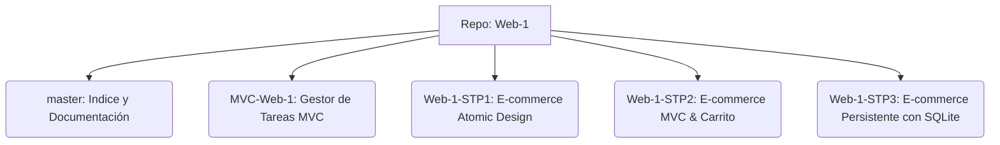

# Trabajos Prácticos - Web 1 (2026)

Este repositorio centraliza todos los proyectos y trabajos prácticos realizados durante la cursada de **Web 1 - 2026**. Para mantener la organización, cada proyecto principal se encuentra en su propia **rama**.

## 🌲 Estructura de Ramas


```mermaid
graph TD
    A[Repo: Web-1] --> B(master: Indice y Documentación)
    A --> C(MVC-Web-1: Gestor de Tareas MVC)
    A --> D(Web-1-STP1: E-commerce Atomic Design)
    A --> E(Web-1-STP2: E-commerce MVC & Carrito)
    A --> F(Web-1-STP3: E-commerce Persistente con SQLite)
```

| Rama | Proyecto | Descripción | Tecnologías |
| :--- | :--- | :--- | :--- |
| [`master`](https://github.com/Niquinhoo/Web-1/tree/master) | Índice | Documentación general del repositorio. | Markdown |
| [`MVC-Web-1`](https://github.com/Niquinhoo/Web-1/tree/MVC-Web-1) | Task Manager | Aplicación de gestión de tareas aplicando el patrón MVC. | Express, EJS, Node.js |
| [`Web-1-STP1`](https://github.com/Niquinhoo/Web-1/tree/Web-1-STP1) | E-commerce | Plataforma de comercio electrónico con arquitectura Atomic Design. | Express, EJS, CSS (Modular), Atomic Design |
| [`Web-1-STP2`](https://github.com/Niquinhoo/Web-1/tree/Web-1-STP2) | E-commerce (S2) | Refactorización a MVC/SSR con gestión de carrito y checkout. | Express, EJS, Sessions |
| [`Web-1-STP3`](https://github.com/Niquinhoo/Web-1/tree/Web-1-STP3) | E-commerce (S3) | Evolución a persistencia relacional SQL real de alto rendimiento. | Express, SQLite, better-sqlite3 |

---

## 🚀 Proyectos Distribuidos

### 1. [Gestor de Tareas](https://github.com/Niquinhoo/Web-1/tree/MVC-Web-1) (Rama: `MVC-Web-1`)
Una implementación limpia del patrón **Modelo-Vista-Controlador**. 
- **Estructura:** Separación clara entre lógica de datos (`models`), lógica de negocio (`controllers`) y presentación (`views`).
- **Funcionalidad:** Listado y detalle de tareas pendientes.

### 2. [E-commerce Premium](https://github.com/Niquinhoo/Web-1/tree/Web-1-STP1) (Rama: `Web-1-STP1`)
Un proyecto avanzado que utiliza **Atomic Design** para una interfaz altamente modular y escalable.
- **Arquitectura:** Componentes divididos en Átomos, Moléculas, Organismos y Plantillas.
- **Características:** 
    - Flujo de compra completo (Carrito, Checkout).
    - Sistema de autenticación (Login/Register).
    - Catálogo dinámico de productos y categorías.
    - Documentación basada en User Stories.

### 3. [E-commerce MVC & Carrito](https://github.com/Niquinhoo/Web-1/tree/Web-1-STP2) (Rama: `Web-1-STP2`)
Este proyecto es la evolución del STP1, migrando a una arquitectura de capas y añadiendo funcionalidades críticas de negocio.
- **Arquitectura:** Refactorización de componentes Atomic Design a una estructura de carpetas `routes`, `controllers`, `services` y `views`.
- **Características:** 
    - Manejo de carrito de compras persistente en la sesión del servidor.
    - Flujo de checkout y confirmación de compra.
    - Manejo global de errores (404, 500, 400).
    - Buscador funcional y filtros por categorías dinámicos.

### 4. [E-commerce con Persistencia SQLite](https://github.com/Niquinhoo/Web-1/tree/Web-1-STP3) (Rama: `Web-1-STP3`)
La evolución a la capa de persistencia real utilizando **SQLite** y el driver de alto rendimiento `better-sqlite3`.
- **Arquitectura:** Estructura en capas (Rutas -> Controladores -> Servicios -> Base de Datos) con inyección idempotente.
- **Características:**
    - Base de datos relacional persistente con 5 tablas integradas (`categories`, `products`, `users`, `orders`, `order_items`) mediante claves primarias y foráneas.
    - Bootstrap de base de datos automatizado y migración segura de datos heredados con transacciones ACID.
    - Seed idempotente de categorías y productos desde archivo JS al iniciar la app.
    - Consultas precompiladas (*Prepared Statements*) con *Bound Parameters* para evitar inyecciones SQL.
    - Desacoplamiento total de dependencias a archivos JSON locales.

---

## 🛠️ Cómo navegar por los proyectos

Para ver el código de un proyecto específico, cambia de rama en tu terminal o en la interfaz de GitHub:

```bash
# Para ver el E-commerce (Sprint 3)
git checkout Web-1-STP3

# Para ver el E-commerce (Sprint 2)
git checkout Web-1-STP2

# Para ver el E-commerce (Sprint 1)
git checkout Web-1-STP1

# Para ver el Gestor de Tareas
git checkout MVC-Web-1
```
