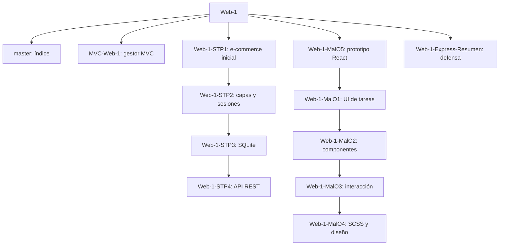

# Trabajos Prácticos - Web 1 (2026)

Este repositorio reúne los trabajos prácticos y proyectos desarrollados durante la cursada de **Web 1 - 2026**. Cada línea de trabajo vive en su propia rama; las ramas no representan todas el mismo proyecto.

## Mapa de ramas


```mermaid
graph TD
    A[Web-1] --> B[master: índice]
    A --> C[MVC-Web-1: gestor MVC]
    A --> D[Web-1-STP1: e-commerce inicial]
    D --> E[Web-1-STP2: capas y sesiones]
    E --> F[Web-1-STP3: SQLite]
    F --> G[Web-1-STP4: API REST]
    A --> H[Web-1-MalO5: prototipo React]
    H --> I[Web-1-MalO1: UI de tareas]
    I --> J[Web-1-MalO2: componentes]
    J --> K[Web-1-MalO3: interacción]
    K --> L[Web-1-MalO4: SCSS y diseño]
    A --> M[Web-1-Express-Resumen: defensa]
```

| Rama | Qué contiene | Estado o propósito |
|---|---|---|
| `master` | Este índice | Navegación y documentación general |
| `MVC-Web-1` | TaskManager con Express y EJS | Ejercicio independiente de MVC |
| `Web-1-STP1` | E-commerce SSR con datos mock | Primera etapa visual y funcional |
| `Web-1-STP2` | E-commerce con rutas, controladores, servicios y sesiones | Arquitectura en capas y carrito |
| `Web-1-STP3` | E-commerce con SQLite y `better-sqlite3` | Persistencia, bootstrap y migraciones |
| `Web-1-STP4` | E-commerce SSR + API REST JSON | Estado actual del backend |
| `Web-1-MalO5` | Base React + Vite | Prototipo inicial de la línea de tareas |
| `Web-1-MalO1` | UI inicial de lista de tareas | Primera entrega visual |
| `Web-1-MalO2` | UI dividida en componentes | Segunda entrega |
| `Web-1-MalO3` | Lista de tareas interactiva | Alta, completado y eliminación |
| `Web-1-MalO4` | Tareas con SCSS y sistema visual | Cuarta entrega frontend |
| `Web-1-Express-Resumen` | Presentación y documentación | Material para la defensa |

## Línea principal: e-commerce

### `Web-1-STP1` — prototipo inicial

Primera versión server-side con Express y EJS. Define las pantallas de home, catálogo, detalle de producto, carrito, login y registro, junto con la organización visual basada en Atomic Design. Usa datos mock en memoria.

### `Web-1-STP2` — arquitectura en capas

Evolución de STP1 que separa rutas, controladores y servicios. Incorpora `express-session` para conservar el carrito, validación backend, búsqueda, filtros por categoría y manejo de errores SSR.

### `Web-1-STP3` — persistencia SQLite

Reemplaza los datos mock por una base SQLite real. Incluye esquema relacional, bootstrap, migraciones de usuarios, seed idempotente, prepared statements y tablas para categorías, productos, usuarios y órdenes. Su estado también contiene endpoints de catálogo, stock/estado y carga local de imágenes.

### `Web-1-STP4` — API REST actual

Mantiene el SSR de STP3 y agrega una salida JSON para clientes externos:

- `GET`, `POST`, `PUT` y `DELETE` de `/api/products`;
- `GET`, `POST`, `PUT` y `DELETE` de `/api/categories`;
- `GET /api/stats` con totales de productos y categorías;
- `express.json()`, CORS, validaciones y errores JSON;
- servicios reutilizados sin duplicar SQL;
- pruebas integradas con SQLite temporal.

Es la rama que corresponde al estado actual del Sprint 4 y prepara el dashboard administrativo del Sprint 5.

## Línea de tareas React: `Web-1-MalO5` → `Web-1-MalO4`

Esta línea es independiente del e-commerce y trabaja un gestor de tareas frontend con React y Vite:

- `Web-1-MalO5`: prototipo base generado con React + Vite.
- `Web-1-MalO1`: reproducción visual de los wireframes, sin lógica de tareas.
- `Web-1-MalO2`: división del componente inicial en componentes con responsabilidades concretas.
- `Web-1-MalO3`: permite escribir, agregar, completar y eliminar tareas.
- `Web-1-MalO4`: agrega SCSS, tema claro, Flexbox, layout líquido y encabezado fijo.

## Ramas independientes

### `MVC-Web-1`

Gestor de tareas simple construido con Node.js, Express y EJS para practicar el patrón Modelo–Vista–Controlador. No forma parte de la evolución del e-commerce.

### `Web-1-Express-Resumen`

Presentación interactiva y documentación para la defensa del proyecto Web-1. Resume las decisiones de MVC, arquitectura por capas, sesiones, SQLite, transacciones y bootstrap; no es el servidor principal.

## Cómo navegar

Para cambiar de proyecto:

```bash
git switch Web-1-STP4
git switch Web-1-STP3
git switch Web-1-MalO4
git switch MVC-Web-1
```

Cada rama contiene su propio README con el contexto y el propósito específico de esa línea de trabajo.
